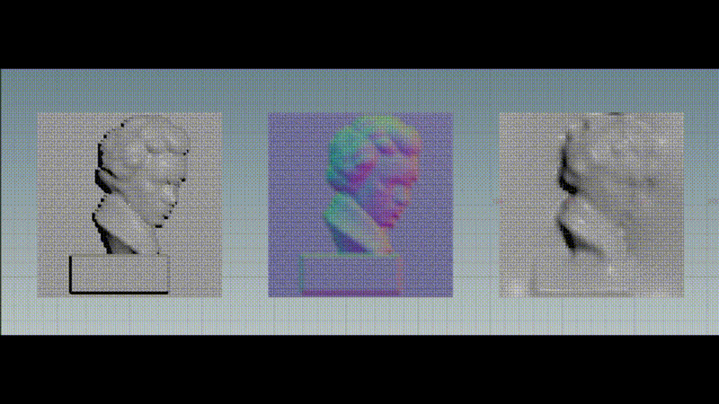

houdini-normal-to-height
===

This is a demo of reconstructing a height map from a normal map using the Poisson equation.
For self-learning, I remade a similar program based on prior examples on the Internet.

NOTES:
- When I set the grid size and division count to a number other than default value(64), the results of the linear equations are not stable. Why? Please someone tell me how to solve this problem...

References:
- [FROM NORMAL MAP TO HEIGHT MAP](https://houdinigubbins.wordpress.com/2019/08/09/from-normal-to-height/)
- [Akira Saito's post on X](https://twitter.com/a_saito/status/1721076487150084376)
- [Houdiniでぽあそん](https://www.monolithsoft.co.jp/techblog/houdini/000456.html)
